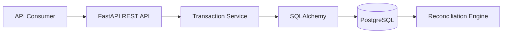
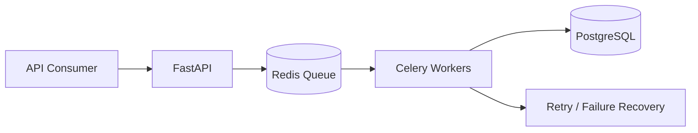
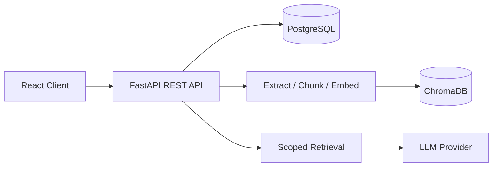
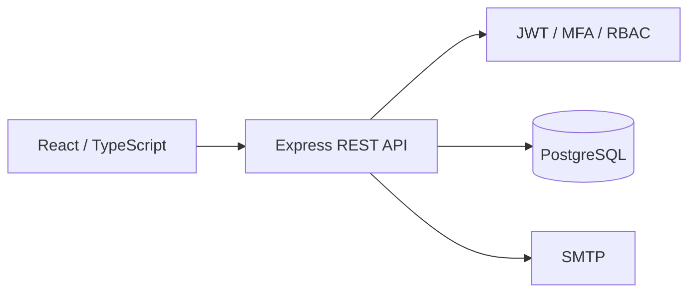
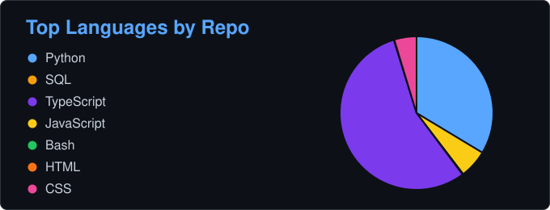

<div align="center">

# Navya Thellapati

### Software Engineer | Backend Engineer | Python | FastAPI | Distributed Systems | PostgreSQL | Cloud & CI/CD

[](mailto:navyachowdary.thellapati@gmail.com)
[](https://www.linkedin.com/in/navya-thellapati/)
[](https://leetcode.com/u/navya_codes/)
[](https://navya-portfolio-sable.vercel.app/Navya-Thellapati-Resume.pdf)

</div>

## Building reliable backend systems, financial platforms, distributed workflows, and data-driven applications

Software Engineer with 4+ years of experience designing Python backend applications, REST APIs, microservice-style components, and data-intensive enterprise systems. My work spans banking workflows, relational database design, SQL optimization, ETL pipelines, workflow automation, Docker, and CI/CD-driven delivery.

<div align="center">

| **10+**<br><sub>Truist backend services and APIs</sub> | **5K+**<br><sub>daily banking records supported</sub> | **40%**<br><sub>deployment-time reduction</sub> | **30%**<br><sub>SQL runtime reduction</sub> |
|:---:|:---:|:---:|:---:|

</div>

## About Me

```yaml
role: Software Engineer / Backend Engineer
experience: 4+ years
core_stack:
  - Python
  - FastAPI
  - PostgreSQL
  - SQL
  - Docker
  - REST APIs
engineering_focus:
  - Backend systems and microservices
  - Financial applications
  - Distributed processing
  - Database design and optimization
  - Workflow automation
  - CI/CD
currently_exploring:
  - RAG and LangChain
  - LLM-integrated applications
  - Vector databases
  - Responsible AI
```

## Current Focus

- Building production-style Python services with FastAPI, explicit validation, authentication, and documented APIs.
- Designing transaction-processing workflows around data integrity, auditability, and failure recovery.
- Developing distributed background-processing patterns with queues, retries, scheduling, and execution tracking.
- Improving relational database performance, reconciliation accuracy, and data consistency.
- Adding retrieval-augmented AI capabilities without losing backend reliability or source traceability.

## Experience Highlights

### Truist - Software Engineer III

<sub>May 2025 - June 2026</sub>

- Designed and maintained 10+ Python backend services and REST APIs supporting account and transaction workflows for 5K+ daily records.
- Architected modular, microservice-style components with separated API, business, and data-access layers, reducing feature-development time by 20%.
- Modeled relational schemas and optimized complex SQL for validation, reconciliation, and reporting, reducing query runtime by 30%.
- Built CI/CD pipelines for packaging, testing, and deployment, reducing deployment time by 40% and improving release consistency.

### Accenture Solutions - Software Engineer

<sub>June 2021 - July 2024</sub>

- Developed Python and SQL automation for account provisioning, workflow orchestration, and data validation, eliminating 300+ recurring checks and improving efficiency by 28%.
- Built and integrated 20+ backend services using Python, REST APIs, and JSON/XML integrations, supporting 6K+ daily records.
- Maintained Python/SQL ETL pipelines for downstream reporting, reducing recurring load errors by 22%.
- Packaged and deployed backend applications with Jenkins, Git, and Azure DevOps across 12+ releases.

## Tech Stack

### Languages

[](https://skillicons.dev)

`Python` `JavaScript` `TypeScript` `SQL` `Bash`

### Backend and Data

[](https://skillicons.dev)

`FastAPI` `Flask` `REST APIs` `Microservices` `SQLAlchemy` `OpenAPI` `JWT` `PostgreSQL` `SQL Server` `SQL Optimization`

### Cloud, Delivery and Tooling

[](https://skillicons.dev)

`Docker` `Jenkins` `GitHub Actions` `Azure DevOps` `Linux` `Git` `CI/CD`

### Frontend, Testing and AI

`React` `HTML5` `CSS3` · `Unit Testing` `API Testing` `Postman` `Regression Testing` · `Pandas` `NumPy` `TensorFlow` `scikit-learn`

## Selected Projects

### [Banking Transaction Processing & Reconciliation System](https://github.com/NavyaThellapati/Banking-Transaction-Processing-Reconciliation-System)

A production-style financial backend centered on transaction integrity, concurrency safety, and auditable reconciliation.

**Engineering highlights**

- Double-entry ledger supporting account creation, deposits, withdrawals, transfers, and transaction history.
- ACID-compliant operations with validation, row-level locking, and deterministic lock ordering.
- Immutable ledger entries designed for traceability and balance consistency.
- Reconciliation checks for missing, duplicate, and mismatched transactions with exception reporting.



**Decisions:** row-level locks protect concurrent balance updates; deterministic lock ordering reduces deadlock risk; immutable ledger entries preserve the audit trail.

`Python` `FastAPI` `PostgreSQL` `SQLAlchemy` `Docker`

### [Enterprise Workflow Automation & Job Processing System](https://github.com/NavyaThellapati/Enterprise-Workflow-Automation-Job-Processing-System)

A distributed backend platform for submitting, scheduling, executing, monitoring, and recovering asynchronous business workflows.

**Engineering highlights**

- FastAPI endpoints for job submission, workflow status, execution history, and queue monitoring.
- Celery workers and Redis queues for asynchronous and scheduled execution.
- Priority queues, task dependencies, retry policies, and failed-job recovery.
- JWT authentication, PostgreSQL persistence, Docker packaging, and GitHub Actions CI/CD.



**Decisions:** background workers isolate long-running work from request handling; Redis provides low-latency queue coordination; explicit retries and failure records make recovery observable.

`FastAPI` `Celery` `Redis` `PostgreSQL` `Docker` `GitHub Actions`

### [DocuMind - AI Document Q&A Assistant](https://github.com/NavyaThellapati/documind-ai-document-qa-assistant)

A full-stack document intelligence platform that processes PDF, TXT, and DOCX files and returns document-grounded answers with verifiable source citations.

**Engineering highlights**

- User- and document-scoped retrieval with Sentence Transformers and ChromaDB.
- JWT access and refresh flows, rate limiting, ownership checks, and Alembic migrations.
- Background document processing, semantic search, streaming chat, feedback, and retrieval evaluation.
- Backend and frontend tests, Docker Compose, GitHub Actions, and deployment configuration.



**Decisions:** source citations make answers auditable; ownership filters isolate user data; a local extractive fallback keeps development and tests independent of an external LLM.

`Python` `FastAPI` `React` `TypeScript` `PostgreSQL` `ChromaDB` `Docker` `GitHub Actions`

### [MyChart Patient Portal](https://github.com/NavyaThellapati/mychart---homepage)

A full-stack patient portal for authenticated appointment workflows, medications, results, billing, messaging, and guided navigation.

**Engineering highlights**

- JWT authentication, optional email MFA, password recovery, role-aware authorization, and audit logging.
- User-level data isolation, parameterized SQL, input validation, rate limits, and scheduling-conflict detection.
- PostgreSQL-backed API integration tests and deployment configuration for Vercel and Render.



**Decisions:** ownership checks are enforced server-side; appointment conflicts are validated before persistence; audit records preserve security-relevant activity.

`React` `TypeScript` `Node.js` `Express` `PostgreSQL` `JWT` `GitHub Actions`

## AI-Integrated Engineering

I use AI as an application capability within reliable software systems: retrieval-augmented generation, semantic search, vector storage, source attribution, prompt design, and LLM API integration. My applied stack includes LangChain, OpenAI API, Llama 3-compatible endpoints, ChromaDB, Sentence Transformers, and vector databases; my primary focus remains backend engineering.

## Languages I Use

| Language | Applied In |
| --- | --- |
| **Python** | Backend services, FastAPI APIs, automation, ETL, data validation, AI integrations |
| **SQL** | PostgreSQL, SQL Server, schema design, reconciliation, reporting, query optimization |
| **JavaScript** | Node.js and Express backend services, browser application logic |
| **TypeScript** | React applications, typed UI components, API clients |
| **Bash** | Local automation, environment setup, CI/CD and deployment workflows |
| **HTML & CSS** | Responsive interfaces, accessibility, component styling |

## GitHub Analytics

<div align="center">

[](https://github.com/NavyaThellapati)

<p align="center">
  
  <a href="https://github.com/NavyaThellapati?tab=repositories"></a>
</p>

[](https://github.com/NavyaThellapati)

</div>

<sub>Language percentages are calculated from source code in public repositories and do not represent overall proficiency or professional experience.</sub>

## Education

### University of South Florida

**Master of Science in Computer Science** · Tampa, Florida · August 2024 - May 2026

## Let's Connect

I am interested in software engineering and backend engineering opportunities involving scalable APIs, distributed systems, financial technology, cloud infrastructure, and data-intensive applications.

- [LinkedIn](https://www.linkedin.com/in/navya-thellapati/)
- [Email](mailto:navyachowdary.thellapati@gmail.com)
- [GitHub](https://github.com/NavyaThellapati)
- [LeetCode](https://leetcode.com/u/navya_codes/)
- [Resume](https://navya-portfolio-sable.vercel.app/Navya-Thellapati-Resume.pdf)
